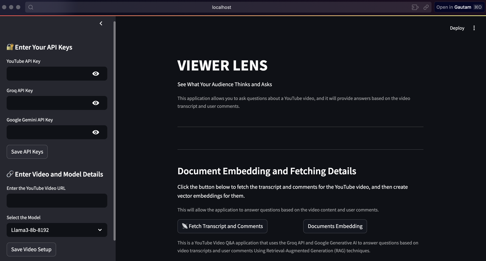
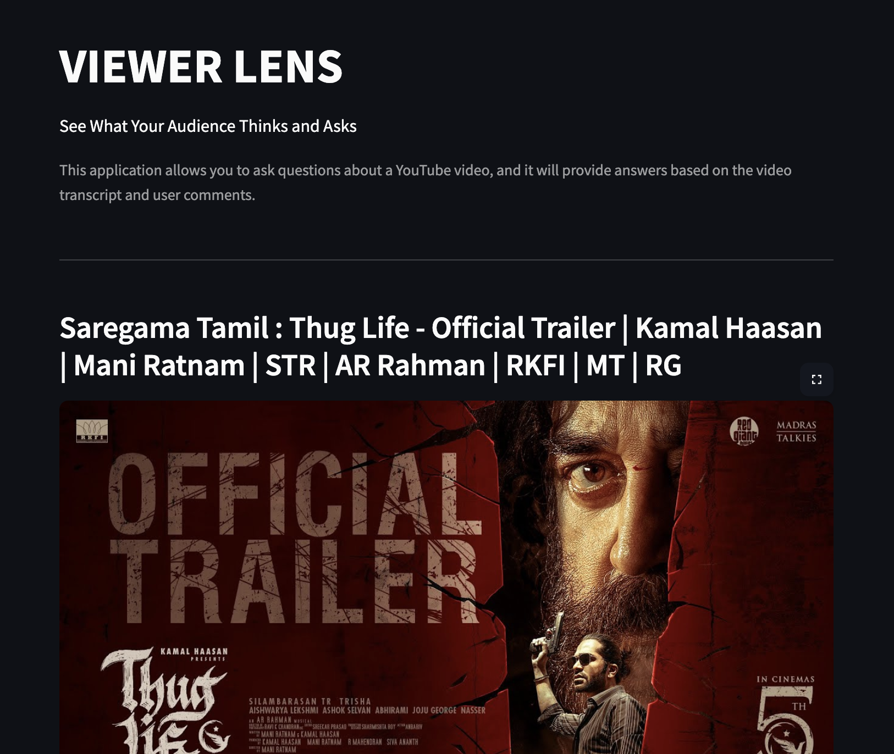
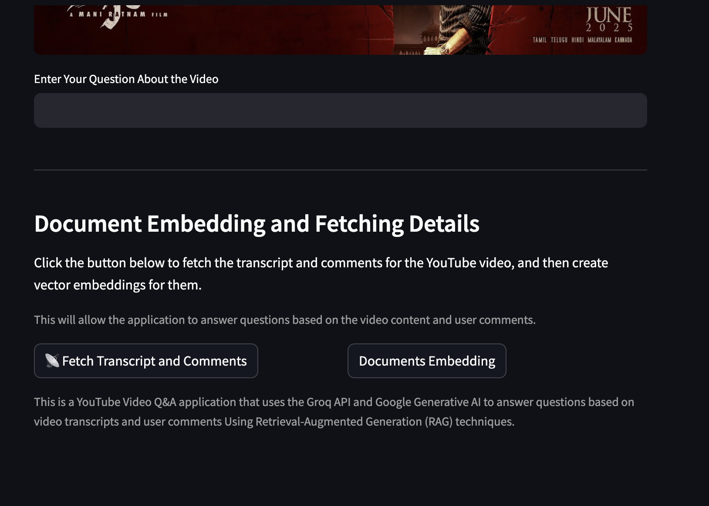
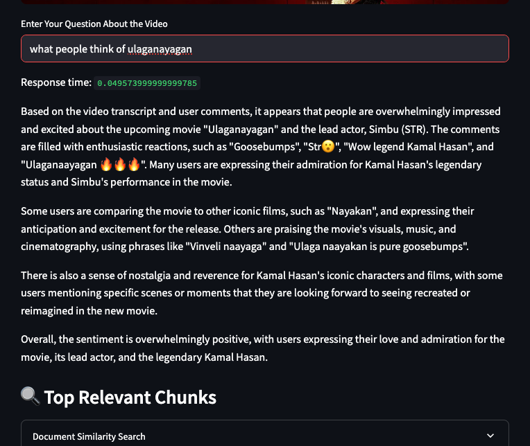
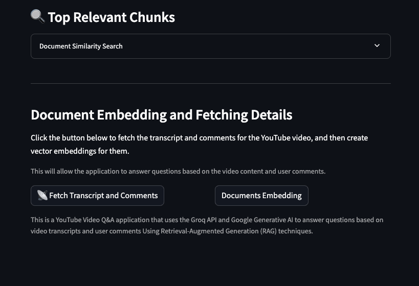
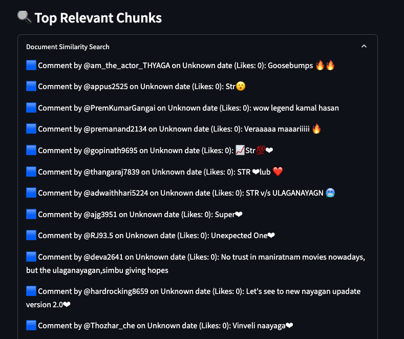

# 🎥 ViewerLens – YouTube Video Q&A with Comments + Transcript Analysis

ViewerLens is an interactive Streamlit application that uses Retrieval-Augmented Generation (RAG) to answer user questions based on the **transcript** and **user comments** of a YouTube video. It leverages the power of **Groq LLMs**, **Google Generative AI**, and **YouTube Data API** for an insightful viewer understanding experience.

---

## 🔍 Features

- 🔑 Securely input API keys (YouTube, Groq, Gemini)
- 📺 Input any YouTube video URL
- 📄 Fetch video transcript and comments
- 🧠 Embed transcript + comments using Google Gemini embeddings and FAISS
- 💬 Ask contextual questions and get relevant answers from the content
- 📎 View relevant document chunks used for answering your queries

---

## 🚀 Tech Stack

- **Streamlit** – UI framework
- **Groq API** – LLM (e.g., LLaMA3, Gemma)
- **Google Gemini API** – Embeddings
- **LangChain** – RAG pipeline
- **FAISS** – Vector store
- **YouTube Data API** – Fetch metadata, transcript, and comments
- **YouTube Transcript API** – Extract video transcript

---

## 🛠️ Setup Instructions

### 1. Clone the Repository

```bash
git clone https://github.com/yourusername/viewerlens.git
cd viewerlens
```

### 2. Install Dependencies

```bash
pip install -r requirements.txt
```

> **Note**: Make sure you also install `ffmpeg`, if required for transcript processing.

### 3. API Keys Required

- **YouTube API Key**
- **Groq API Key**
- **Google Gemini API Key**

Store them in the Streamlit sidebar inputs when running the app.

### 4. Run the App

```bash
streamlit run app.py
```

---

## 📦 Directory Structure

```
├── app.py                    # Main Streamlit application
├── data/
│   ├── transcript.txt        # Fetched transcript
│   ├── youtube_comments.json# Fetched comments
│   └── About.json            # Video metadata
```

---

## 🧪 How It Works

1. **Input Video URL + API Keys**
2. **Fetch Data**: Video details, transcript, comments
3. **Vector Embedding**: Merge transcript + comments, embed with Gemini, store in FAISS
4. **Ask Questions**: Use Groq-powered LLM to answer based on retrieved document chunks

---

## 🧠 Example Use Cases

- Analyze viewer sentiment from comments
- Understand what viewers are asking or discussing
- Summarize video content interactively
- Create insights for content creators

---

## 📌 To-Do

- [ ] Add sentiment analysis on comments
- [ ] Support multiple videos
- [ ] Dockerize the application
- [ ] Save conversation history

---
## 📷 Media

|  |  |
|------------------------------|------------------------------|
|  |  |
|  |  |

---

## 📝 License

MIT License

---

## 🙌 Acknowledgements

- [LangChain](https://github.com/langchain-ai/langchain)
- [Streamlit](https://streamlit.io/)
- [Google Generative AI](https://ai.google.dev/)
- [Groq](https://groq.com/)
- [YouTube Data API](https://developers.google.com/youtube/v3)